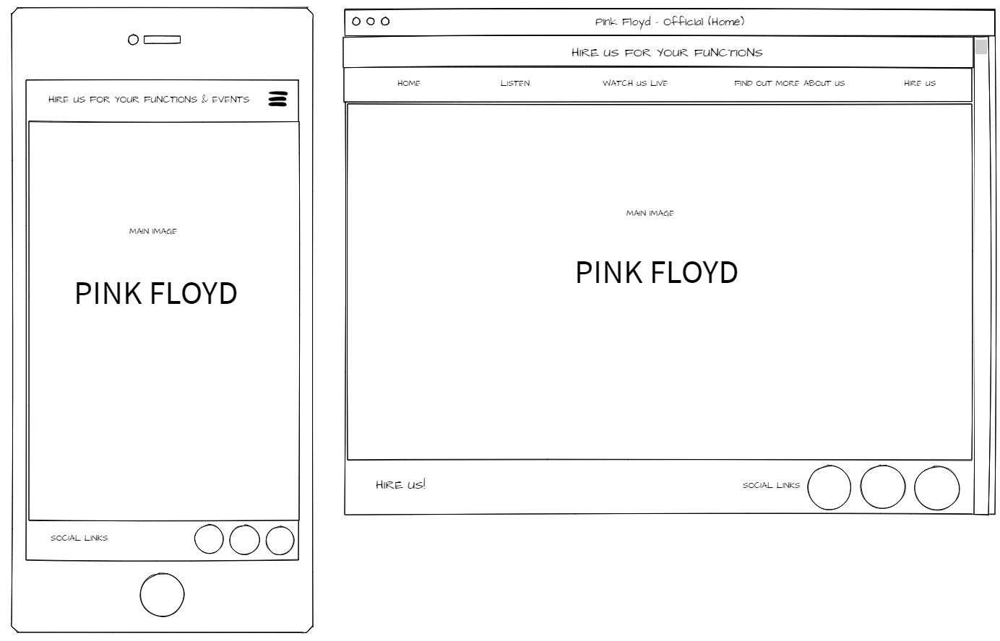
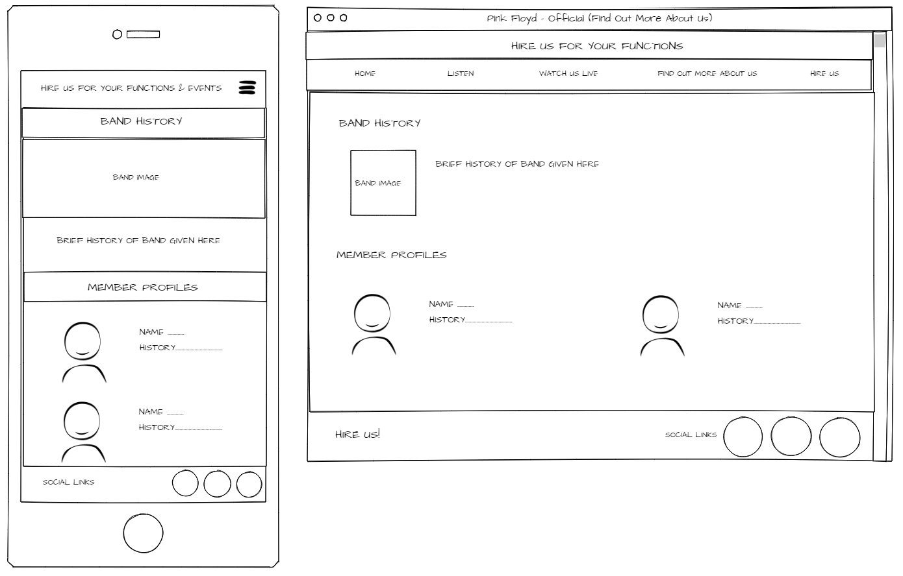

# Pink Floyd Official Site: Milestone Project 

## Purpose

The purpose of the project is to build a front-end website for the band "Pink Floyd". The target audience for this website are current fans and any potential new fans. The site will be used to showcase their music and publicise their availablity to perform at events. The website content will contain the following:

* Photos of the band members
* Video clips
* Audio clips
* Links to their social media pages.

## Planning
The following outlines the planning undertaken for the project based on building a static website for a 1960’s rock band. I’ve chosen ‘Pink Floyd’ because of the wealth of material available and the diverse and interesting imagery used by the band. 

### Strategy Plane 

The business and customer objectives are defined within this section.

#### Business Objectives

* *Who are our target audience?*  Current and potential fans
* *What is compelling site visitors to come to the site?* The opportunity to see and hear music from the back catalogue and from the latest releases. Additionally, the opportunity to hire the band to perform at events.
* *Why is this site different from our competitors?* This is the ‘official’ band site therefore new material releases from the band will debut here first. Additionally, a hire request page allows fans to hire the band to perform at events and functions. 

##### Baseline business objectives:
*	Showcase band materials (music and videos)
*	Allow band hiring for events and functions (weddings and Xmas parties).
*	Increase fan base
*	Increase online presence

#### User Objectives

* *What content are you wanting on the site?*  Band information, tour dates, biographies, music catalogue and videos, additional links and information.

##### Baseline user needs:
*	Access to new releases and music back catalogue 
*	Videos of the band performing
*	Images of the band/members
*	Biographies of band members and band history
*	Discography 
*	Links to other relevant sites and social media
*	Tour dates and links of where to buy tickets for shows

#### Project Baseline Requirements

Combining the baseline business and user requirements produces the baseline requirements for the project:

*	Music and videos
*	Band hire
*	Image gallery
*	Band history and biographies
*	Discography
*	Social media links 
*	Tour dates and ticket links

#### Importance and viability/feasibility assessment

| Opportunity | Importance | Viability/Feasibility | Total |
| ------------|------------|-----------------------|-------|
|  Music and video| 4 | 5 |  9|
|  Band hire  | 4 |5 |9|
| Image gallery |2|3|5|
| Band history and biography|2|4|6|
| Discography|2|2|4|
| Social media links|4|5|9|
| Tour dates and ticket links | 3| 1|4|
|*Summary* |*21*|*25*|-|

### Scope Plane 
What will and will not be included in the website is determined in this section based upon the strategy plane assessment.

##### What will be included in the first release?
*	Music and videos
*	Band hire
*	Band history and biographies
*	Social media links 

##### What can wait until a website update?
*	Image gallery
*	Discography
*	Tour dates and ticket links

### Structure Plane

The structure of the website and the UX design is defined as follows:

#### Site structure

The main structure of the project is defined as follows:

* Header bar: located at the top and identical on every page
 
    * Bar at top will advertise that the band are available for bookings, this will be linked a ‘Hire’ webpage

    * Navigation bar (desktop) and navigation-symbol (mobile) located at top each page allows direct access to each page from every other page
    
*	The project will contain the following content pages:
    1.	Home: the opening site page
    2.	Listen: will contain new and previous audio for the user to listen to
    3.	Watch us live: will contain videos of the band performing
    4.	Biography: will contain a band overview and member profile
    5.	Hire us: will contain a calendar of available dates and a submission form to enquire about hiring the band        

*	Footer located at the bottom and identical on every page:
    1.	Social links: contains social media links which will open in a new browser window
    2.	Hire link: which will be linked to the ‘Hire’ webpage 

#### UX design

Responsive design is implemented as follows: 
* Page layout will be optimised for the screen resolution it is viewed upon, from 360px to 3840 px
* The hire us alert in the header will disappear on smaller screen resolutions but will remain on the bottom
* Social links will disappear at smaller screen resolutions

User feedback will be provided as follows:
  
* Link buttons: will change upon hover (desktop) to show the user that a link these sites is provided
* Mobile navigation icon: will expand and collapse on click to allow greater space for content on mobile version
* Social links: will change upon hover (desktop) 
* Hire us calendar will highlight selected date
* ‘Submit request’ button on ‘Hire’ page will change upon  upon click
* responsive

### Skeleton Plane

The preliminary skeletal design for each of the pages defined are shown below:

#### Home page

#### Listen page

#### Watch page

#### Biography page

#### Hire us page

### Development schedule

The development is broken down into sprint stages (16-24 non-consecutive hours per sprint), these are defined as follows: 

| Sprint | Tasks |
|--------|-------|
|1| Header | 
|2|  Footer and social links |
|3| Navigation layout |
|4| Home page|
|5| Music page|
|6| Video page|
|7|Band history and biographies page|
|8|Band hire page|
|9| Final site presentation|
|10| Read me documentation 

## Project Implementation
Responsive deisng

no hire bar at top....calendar in hire page

## Project Testing

### HTML Validation 
Each page of the site was ran through the [W3C markup validation Service](https://validator.w3.org/)

### Custom CSS Validation 
The css stylesheet was run through the [W3C css validation Service](https://jigsaw.w3.org/css-validator/)

[Validated css script](https://github.com/chrismurray1980/Pink-Floyd-Official-Milestone-Project/html_css_validation_documents/w3c_css_validator_results.pdf) 

### Functional testing

### Non-functional testing

## Project Deployment

## Project Deployment Testing

## References

1. *REFERENCE 1:* Collapsible navbar code URL(https://www.w3schools.com/bootstrap4/tryit.asp?filename=trybs_navbar_collapse&stacked=h)
2. *REFERENCE 1:* Collapsible Navbar button URL(https://mdbootstrap.com/components/bootstrap-hamburger-menu/)
3. *REFERENCE 1:* Adding images to page tab URL(https://stackoverflow.com/questions/20900670/how-to-add-an-image-in-the-title-bar-using-html/20900719)
4. *REFERENCE 1:* Covering background image URL(https://www.w3schools.com/howto/howto_css_full_page.asp)
5. *REFERENCE 1:* mbed video on iframe  URL(https://getbootstrap.com/docs/4.1/utilities/embed/)
6. *REFERENCE 1:* Embed MP3 on page URL(https://www.w3schools.com/html/tryit.asp?filename=tryhtml5_audio_all)
7. *REFERENCE 1:* Bootstrap form  URL(https://getbootstrap.com/docs/4.0/components/forms/)
8. *REFERENCE 1:* flicker animation URL(https://stackoverflow.com/questions/23985018/simple-css-animation-loop-fading-in-out-loading-text/31458204)
9. *REFERENCE 1:* implement js in html URL(https://www.w3schools.com/js/tryit.asp?filename=tryjs_whereto_body)
10. *REFERENCE 1:* star back 1 URL(https://www.google.com/url?sa=i&rct=j&q=&esrc=s&source=images&cd=&cad=rja&uact=8&ved=2ahUKEwjI3vnsuuTbAhWGtxQKHf3ZBj8QjRx6BAgBEAU&url=https%3A%2F%2Fblog.oup.com%2F2015%2F12%2Fblack-actors-star-wars%2F&psig=AOvVaw2PnHFGvhxdJgr7rgs4hOqq&ust=1529660302883785)
11. *REFERENCE 1:* pink floyd band URL(https://wallpaper.wiki/wp-content/uploads/2017/05/Pink-Floyd-Band-Photo-Young-HD-Wallpaper.jpg)
12. *REFERENCE 1:* syd_barrett  URL(http://images5.fanpop.com/image/photos/31400000/Syd-Barrett-syd-barrett-31467482-477-500.jpg)
13. *REFERENCE 1:* roger waters URL(https://www.biography.com/.image/ar_1:1%2Cc_fill%2Ccs_srgb%2Cg_face%2Cq_auto:good%2Cw_300/MTIwNjA4NjM0MTYzNTI5MjI4/pink-floyd-with-syd-barrett.jpg)
14. *REFERENCE 1:* dave gilmour URL(http://images5.fanpop.com/image/photos/25900000/dave-david-gilmour-25948692-382-500.jpg)
15. *REFERENCE 1:* nick mason URL(https://img.discogs.com/il4NYsftq1sRNNkfuXLeotqTyIQ=/fit-in/300x300/filters:strip_icc():format(jpeg):mode_rgb():quality(40)/discogs-images/A-246097-1345122151-3979.jpeg.jpg)
16. *REFERENCE 1:* rick wright URL(https://78.media.tumblr.com/5db6e29dc466ad84425a622dcbe0a8cb/tumblr_p6d6ukvGq21t2fw1ho1_r1_500.jpg)
17. *REFERENCE 1:* pulse live URL(https://www.google.co.uk/url?sa=i&rct=j&q=&esrc=s&source=images&cd=&cad=rja&uact=8&ved=2ahUKEwiQ1vW5k_HbAhVHxRQKHag-AdMQjRx6BAgBEAU&url=https%3A%2F%2Fwww.imdb.com%2Ftitle%2Ftt0110758%2Fmediaviewer%2Frm1172909824&psig=AOvVaw33lm5QIpcGCL8wxfSQJFFm&ust=1530096362001648)
18. *REFERENCE 1:* tw1 URL(http://www.magicfmalgarve.com/wp-content/uploads/2017/12/pink-floyd-the-wall-art-amazing-pink-the-wall-art-artwork-artist-prints-article-animation-s-pink-floyd-the-wall-album-cover-images.jpg)